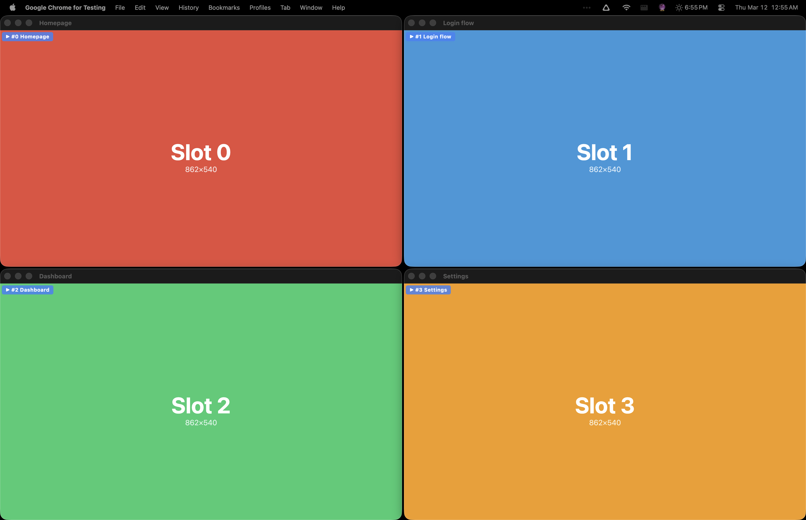

# browser-grid

Tile Playwright browser windows in a grid so you can watch parallel tests run.

> No tool like this exists. Run `npx tsx demo.ts` to see it in action.



## Install

```bash
npm install browser-grid
```

Requires `@playwright/test >= 1.40` as a peer dependency.

## Quick Start

Three lines to get auto-tiling in your Playwright tests:

```ts
// tests/example.spec.ts
import { gridTest as test } from 'browser-grid';
import { expect } from '@playwright/test';

test('loads homepage', async ({ gridPage }) => {
  await gridPage.goto('https://example.com');
  await expect(gridPage).toHaveTitle(/Example/);
});
```

Run with headed mode:

```bash
npx playwright test --workers=4 --headed
```

Each worker's browser snaps to a grid slot — chromeless app-mode windows with no tab bar or URL bar. No overlap, no config needed.

## Configuration

Add `gridConfig()` to your `playwright.config.ts` for custom layouts:

```ts
import { defineConfig } from '@playwright/test';
import { gridConfig } from 'browser-grid';

export default defineConfig({
  use: {
    ...gridConfig({
      preset: 'auto',                          // or 'duo', 'quad', 'six', 'eight', 'nine'
      gap: 4,                                   // pixels between windows
      reserve: { side: 'right', size: 700 },   // keep terminal visible
      overlay: true,                            // show slot labels (default: true)
      overlayDuration: 3000,                    // auto-hide after 3s (0 = always show)
      appMode: true,                            // chromeless windows (default: true)
    }),
  },
});
```

## CLI

```bash
# Show detected screen info
browser-grid info

# Print slot positions for 8 workers
browser-grid slots 8

# With gap and reserve zone, output as JSON
browser-grid slots 8 --gap 4 --reserve right 700 --json
```

## Presets

| Preset  | Layout | Slots | Best for |
|---------|--------|-------|----------|
| `duo`   | 2x1    | 2     | Side-by-side comparison |
| `quad`  | 2x2    | 4     | Standard parallel runs |
| `six`   | 3x2    | 6     | Medium parallelism |
| `eight` | 4x2    | 8     | High parallelism |
| `nine`  | 3x3    | 9     | Maximum visibility |
| `auto`  | varies | n     | Auto-picks based on worker count |

## API Reference

### Fixture

#### `gridTest`

Extended Playwright `test` object with a `gridPage` fixture. The page is automatically positioned in a grid slot based on the worker's `parallelIndex`.

```ts
import { gridTest as test } from 'browser-grid';

test('my test', async ({ gridPage }) => {
  // gridPage is a regular Playwright Page, already positioned
  await gridPage.goto('https://example.com');
});
```

#### `gridConfig(options?)`

Returns configuration to spread into `use` in `playwright.config.ts`. Automatically sets up app-mode chrome flags.

| Option | Type | Default | Description |
|--------|------|---------|-------------|
| `preset` | `string \| GridConfig` | `'auto'` | Grid preset name or custom `{ cols, rows }` |
| `workerCount` | `number` | `4` | Worker count hint for auto preset |
| `gap` | `number` | `0` | Pixels between windows |
| `reserve` | `{ side, size }` | none | Reserve screen region |
| `overlay` | `boolean` | `true` | Show slot label overlay |
| `overlayDuration` | `number` | `0` | Auto-hide overlay after ms (0 = always show) |
| `overlayPosition` | `string` | `'top-left'` | Overlay corner: `top-left`, `top-right`, `bottom-left`, `bottom-right` |
| `appMode` | `boolean` | `true` | Use chromeless app-mode windows (no tab/URL bar) |
| `screenWidth` | `number` | auto-detect | Override screen width |
| `screenHeight` | `number` | auto-detect | Override screen height |
| `topOffset` | `number` | auto-detect | Menu bar offset in pixels |

### Grid Math

#### `getSlot(index, config): SlotResult`

Compute the position and size for a specific grid slot.

```ts
import { getSlot, presets } from 'browser-grid';

const slot = getSlot(0, { ...presets.quad, gap: 4 });
// slot.position  → { x: 0, y: 25 }
// slot.viewport  → { width: 862, height: 544 }
// slot.bounds    → { left: 0, top: 25, width: 862, height: 544 }
// slot.launchArgs → ['--window-position=0,25', '--window-size=862,544']
```

#### `getAllSlots(config): SlotResult[]`

Get all slots for a grid configuration.

#### `createGrid(options): GridConfig`

Create a grid config from presets and options. Resolves `'auto'` preset based on worker count.

#### `autoPreset(workerCount): GridConfig`

Pick the smallest preset that fits the given worker count.

### Chrome Flags

#### `APP_MODE_FLAGS`

Chrome launch args for fully chromeless windows. No tab bar, no URL bar — just the page content with a thin title bar.

#### `MINIMAL_CHROME_FLAGS`

Chrome launch args that keep the normal browser UI but strip bookmarks, extensions, sync prompts, etc.

### CDP Positioning

#### `setWindowBounds(page, bounds): Promise<boolean>`

Position a browser window using Chrome DevTools Protocol. Returns `true` on success, `false` if CDP is unavailable (non-Chromium browsers).

#### `getWindowBounds(page): Promise<WindowBounds | null>`

Read current window bounds via CDP. Returns `null` if unavailable.

### Screen Detection

#### `detectScreen(): ScreenInfo`

Detect macOS screen resolution and menu bar offset. Falls back to 1728x1117 (MacBook Pro default) if detection fails.

### Overlay

#### `injectOverlay(page, options)`

Inject a slot label into the page. Semi-transparent, `pointer-events: none`, won't interfere with tests.

#### `updateOverlay(page, options)`

Update the overlay text (e.g., when a new test starts in the same worker slot).

#### `removeOverlay(page)`

Remove the overlay from a page.

## Standalone Usage

### `launchGrid(options)` — the easy way

Launch multiple browsers in a tiled grid with one call. Handles sequential launch, CDP positioning, overlays, and cleanup.

```ts
import { launchGrid } from 'browser-grid';

const grid = await launchGrid({
  count: 4,
  labels: ['Homepage', 'Login', 'Dashboard', 'Settings'],
  reserve: { side: 'right', size: 700 },
});

// Each slot has a page ready to use
await grid.get(0).page.goto('https://example.com');
await grid.get(1).page.goto('https://example.com/login');

// Update status overlays as tests progress
await grid.get(0).setStatus('passed', 'Homepage ✓');
await grid.get(1).setStatus('failed', 'Login ✗');

// Clean up
await grid.closeAll();
```

| Option | Type | Default | Description |
|--------|------|---------|-------------|
| `count` | `number` | required | Number of browser windows |
| `preset` | `string \| GridConfig` | `'auto'` | Grid layout |
| `gap` | `number` | `4` | Pixels between windows |
| `reserve` | `{ side, size }` | none | Reserve screen region |
| `appMode` | `boolean` | `true` | Chromeless windows |
| `overlay` | `boolean` | `true` | Show slot labels |
| `labels` | `string[]` | `['Slot 0', ...]` | Custom slot labels |
| `extraArgs` | `string[]` | `[]` | Additional Chrome launch args |
| `launchDelay` | `number` | `200` | ms between sequential launches |

### Low-level API

You can also use the grid math, chrome flags, and CDP functions directly:

```ts
import { chromium } from 'playwright';
import { getSlot, setWindowBounds, APP_MODE_FLAGS } from 'browser-grid';

const config = { cols: 2, rows: 2, gap: 4 };
const slot = getSlot(0, config);

const browser = await chromium.launch({
  headless: false,
  args: [...slot.launchArgs, ...APP_MODE_FLAGS],
});
const context = await browser.newContext({ viewport: slot.viewport });
const page = await context.newPage();

// Precise positioning via CDP
await setWindowBounds(page, slot.bounds);
```

## How It Works

1. **Grid math** divides available screen space into cells based on cols/rows, accounting for gaps, menu bar offset, and reserved zones.
2. **Screen detection** reads macOS `system_profiler` for logical resolution and dock position. Falls back to sensible defaults.
3. **App-mode windows** use Chrome's `--app` flag to remove the tab bar and URL bar, maximizing the viewport area.
4. **CDP positioning** uses `Browser.setWindowBounds` for pixel-precise window placement after launch. Launch args (`--window-position`, `--window-size`) provide initial positioning.
5. **Slot overlay** injects a small label via `page.evaluate()` + `page.addInitScript()` so it persists across navigations.

## Notes

- **Chromium only** for CDP-based precise positioning and app-mode. Firefox and WebKit fall back to launch args (approximate positioning).
- **macOS optimized** for screen detection. Other platforms use default 1728x1117 resolution (override with `screenWidth`/`screenHeight`).
- **Headful only** — this package is designed for watching tests run. In headless mode, positioning is a no-op.

## License

MIT
